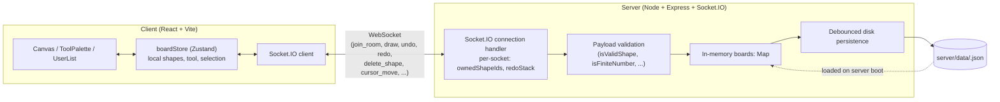
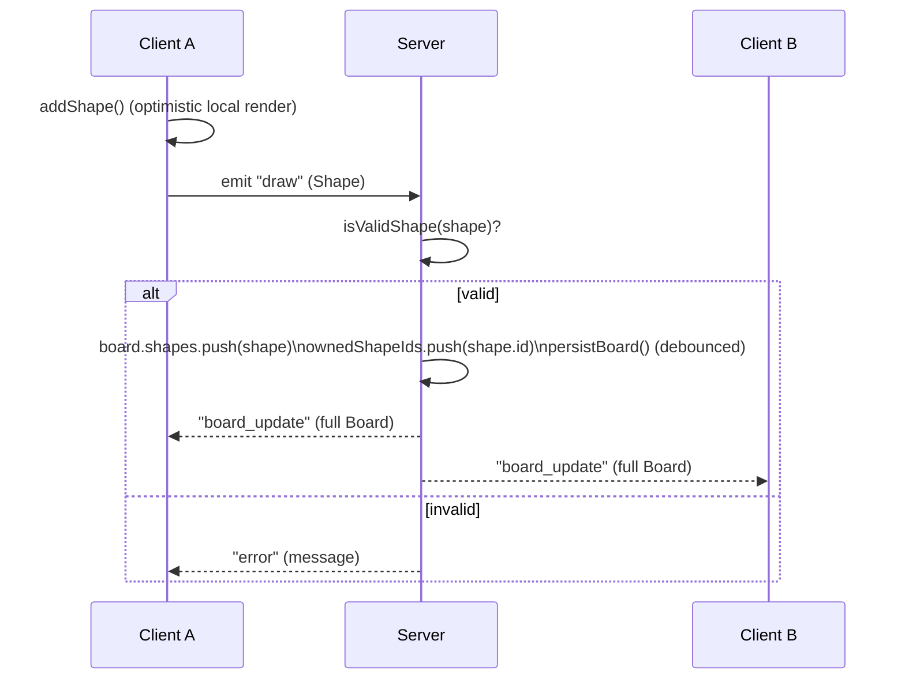
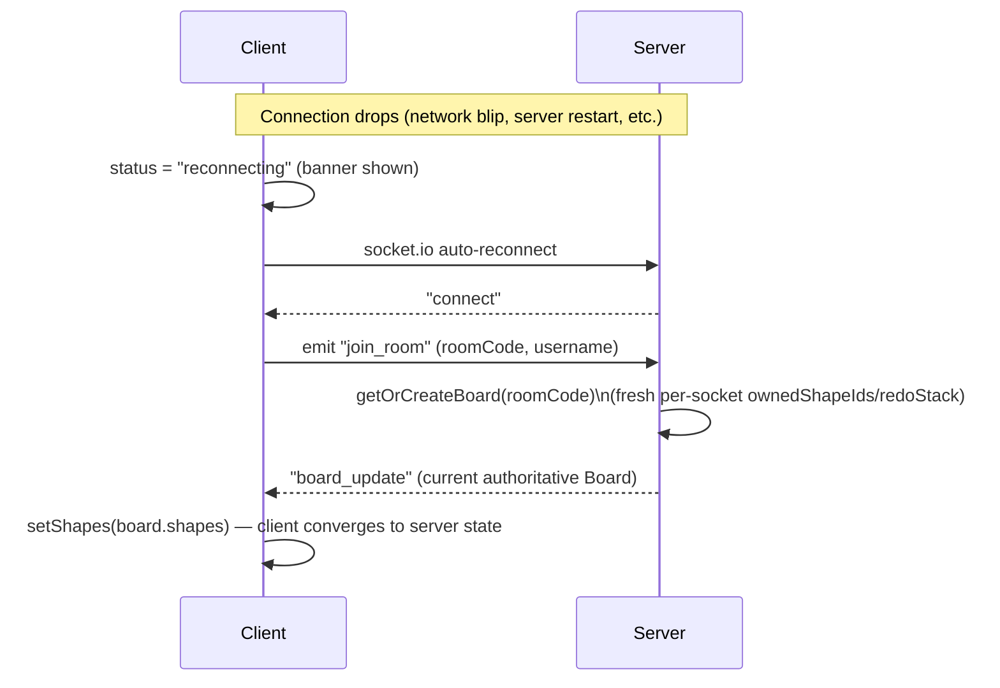

# Architecture

## Components

- **Server is authoritative.** Every client optimistically renders its own actions locally, but the server's `board_update` is the single source of truth all clients converge on — this is what makes multi-user sync and reconnect recovery possible (see [event-protocol.md](event-protocol.md)).
- **Room state lives in server memory**, keyed by room code, and is debounce-persisted to disk so a server restart doesn't lose boards.
- **Undo/redo state is per-socket**, not per-board — each connection tracks only the shape ids *it* drew (`ownedShapeIds`) and its own `redoStack`, so one user's undo never touches another user's shapes.

## Draw event flow

## Reconnect flow

Reconnect always re-fetches the full board rather than diffing, so the client can't drift from the server after a gap — at the cost of per-connection undo/redo history resetting on reconnect (there is no cross-reconnect undo stack by design).
